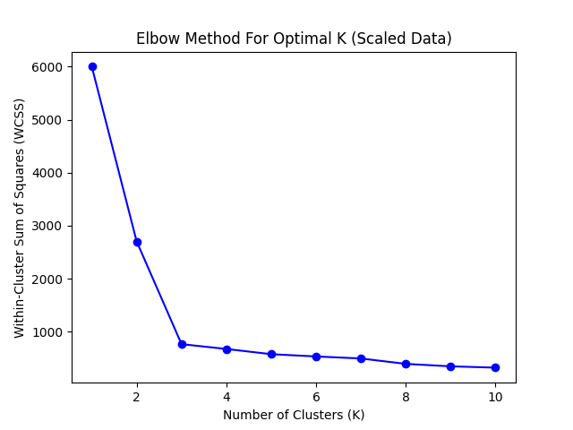
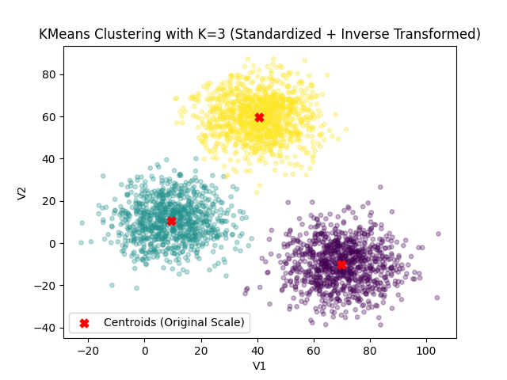

## K-Means Clustering: With Standardization and Inverse Transform

This notebook is part of my personal study and practice in unsupervised machine learning, with a specific focus on K-Means clustering using standardized features. It demonstrates how to apply K-Means clustering **after standardizing** the features with `StandardScaler`. Additionally, it performs an **inverse transformation** of the cluster centers to visualize them in the original feature space. In this notebook, I will explore:

- Data loading and visualization
- Choosing the optimal number of clusters using the Elbow Method
- Applying K-Means and visualizing the result

---

## 📁 Project Files

- `K-means-Standardized.ipynb` — Main Jupyter notebook with step-by-step explanation and results
- `data.csv` — Input dataset

---

## 🛠️ Technologies Used

- Python 3
- scikit-learn
- pandas
- matplotlib

---

## 🖼️ Visualization

  
  

